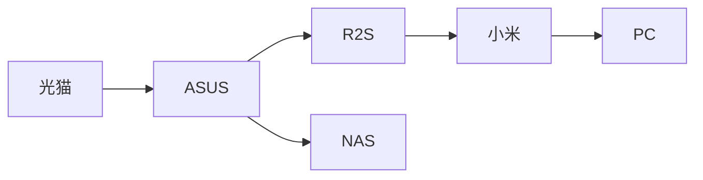

```mermaid
graph LR
光猫 --> ASUS
ASUS --> R2S
ASUS --> NAS
R2S --> 小米
小米 --> PC
```

光猫：未改桥接，关ipv6防火墙，DMZ到ASUS  
ASUS：做主路由，开ipv6防火墙，ipv6选passthrough模式  
R2S：关ipv6防火墙，所有接口ipv6都选中继模式  
小米：改成中继模式当成R2S的AP使用  
