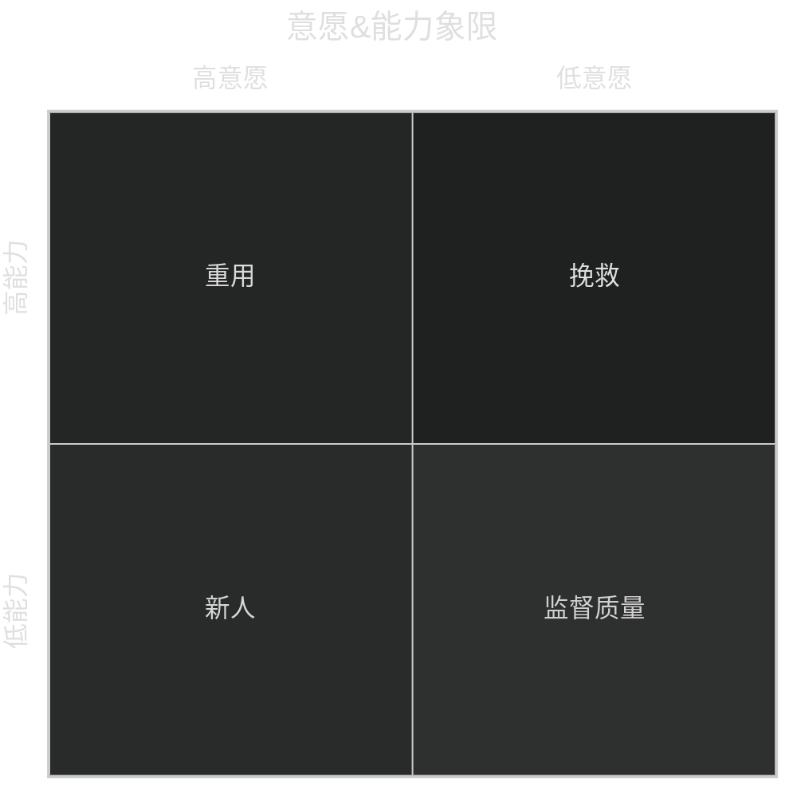

# 有效激励

多种需求共存，只有一个占主导地位。

需求结构动态变化，从内向外，从下向上。

双因素理论。

保健因素，激励因素。

组织目标-高水平努力-个体需要

投其所好，但坚守原则

$$\frac{Op}{lp}=\frac{Oa}{la}$$

高意愿，高能力：重用

低意愿，高能力：挽救or勿留

高意愿，低能力：新人

低意愿，低能力：低风险重复工作

关注事，更要关注人

不要上来直接谈工作

工作与非工作内容不要一起谈

谈日常生活以员工为中心

关心琐事

赞美

挑战型工作

参与式管理（代理参会）

正确批评下属

抱怨是激励方案的重要来源

乐于倾听抱怨

详细了解抱怨的真实原因

及时处理或向上反应，形成闭环

不合理的抱怨进行有效沟通

管理工作就是激励

超过他现有水平，在他人帮助下能完成的

工作量，工作标准，工作难度，工作进度

长处和爱好

提供资源

提醒求助

达成详细的评级标准

批评下属

三明治法

你拥有无尽的激励资源

自我激励与激励他人

作业：

1. 建立下属的信息档案
2. 一周内无成本的激励2名下属

如何建立员工档案

1. 学校
2. 家庭情况
3. 状态
4. 历史沟通记录
5. 个人追求，发展路径，与性格相匹配
6. 想了解什么？
7. 对问题的洞察力考察，评价视野如何，Ego如何
    1. 业务挑战是什么？
    2. 为什么会有这样的挑战？
    3. 公司最大的机会或机遇
    4. 我们如何抓住机遇
    5. 角色互换会怎么做

# 有效沟通

对上，对下，周边

除去睡眠，70%的时间用于信息获取

70%的错误是因为不善于沟通

正确的时机，正确的场合，正确的信息，正确的对象

信息流失原理

沟通如果处在盲目区/未知区，容易出现信任危机

专业，敬业，真诚与诚意

尊重，关爱，信任

积极主动

5W1H

同理心

面对面

优：直观，身体语言，易于讲真

缺：时间匹配，立即思考，不易结束

会议

优：工具，传达，集思广益

缺：耗时，杂乱，极端化

电话

优：迅速，方便

缺：误解，没有记录

邮件：

优：简短，有据，多准备

缺：反馈慢，无法控制对方行为

不要转发邮件or群组批评邮件

少用感叹号和问号

尽量不用反问句

重要性不高不要抄送主管

不要用邮件吵架

倾听

说明原因

说明终止日期

说明工作方案

说明时间期限

说明执行程度

及时表扬（公开）

适时批评（私下）

冲突化解

消除信息盲区

70%的问题来自于情绪

认清沟通的价值

上一次沟通的课程

绩效沟通的时候，同理心的使用

情绪是无法隐藏的，调整好自己

把心态放正，保证更开放的思考

对事实的调查，自己的公正心态更重要。

细微的小事也要讨论。

清晰的阐述问题很重要，在阐述过程中有解决问题的思考。

信息 or 价值观 沟通 or 选择

冲突型沟通，要先设定前提，有同理心，准则

不要给上司做问答题，提供选择题式的方案

要有答案，要有对策

对于下发的任务要保证听懂，当场确认细节

探讨可行性

详细计划，反馈频次

尊重不吹捧，请示不依赖，主动不越权

资讯和数据更有说服力

提方案的方法： 如何实现 如何证实 结果如何

如何辅导下属

辅导但不动手，习惯依赖他人决策

SMART化，5W1H

信息不对称&预设立场

周边沟通

1. 高看自己，看低他人
2. 不能换位思考
3. 失去权力
4. 职权划分
5. 甩锅
6. 利益冲突，唯恐别人比自己强

如何做好周边沟通

1. 加强交流，注重沟通
2. 保持友好，把握距离
3. 互相合作，积极竞争

作业： 针对你在日常沟通中的困惑做出改进计划，使用课堂学到的技巧尝试。